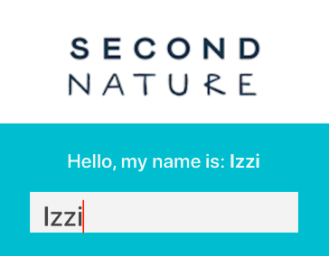

## Second Nature Challenge Project 

 Requirements:
1. The app should display the Second Nature logo at the top
2. The app should have text underneath the logo reading 'Hello, my name is '
3. The app should have a text input underneath the 'Hello, my name is ' which when text is entered, appends text to the end of 'Hello, my name is '

Run instructions for iOS:
* cd into project directory ("second-nature-coding-challenge") && `npx react-native run-ios`
OR
* Open SecondNatureProject/ios/SecondNatureProject.xcworkspace in Xcode or run `xed -b ios`
  - Hit the Run button

Run instructions for Android:
* Have an Android emulator running or a device connected.
* cd into project directory (second-nature-coding-challenge)" && `npx react-native run-android`

#### Design Decisions
Due to the simple nature of interaction in the application, I chose to contain all functionality in the highest-level App component, rather than breaking it up into subcomponents (i.e. to take in user input, to display the name, etc.). For this reason, no use of props, and only the simplest possible component state were necessary.

As the user types input into the text input on the app, the App component's state is automatically updated. I wanted to adhere strictly to the outline provided to me, but an alternative design here would be to add a submit button that updates the displayed text with the full word, rather than character by character.

